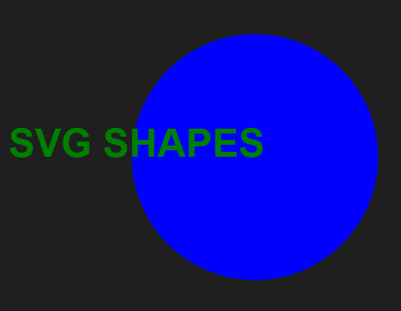

# svg-logo-maker

Motivation
- As a freelance web developer, the need to have an efficient solution for generating logos without the reliance on a graphic designer became essential. The motivation behind this Logo Generator is to offer a streamlined command-line tool that empowers developers to create simple logos tailored to their projects' needs independently, minimizing the cost associated with hiring a graphic designer.

Purpose
- The Logo Generator serves as a versatile command-line application designed specifically for freelance web developers. Its purpose is to provide a user-friendly interface that accepts user input for text, colors, and shapes, enabling quick and customized logo creation. By eliminating the necessity of engaging a graphic designer, this tool aims to enhance developers' autonomy in project logo creation while maintaining simplicity and flexibility.

Problems
- Reducing the need for external graphic designers for basic logo needs, resulting in cost-saving for freelancers.
- Offering developers the ability to create customized logos that align precisely with their project requirements.
- Providing a quick and straightforward solution for logo generation through a command-line interface

Learnings
- Understanding and implementing interactive command-line applications using Node.js for efficient user input handling.
- Learning the basics of SVG rendering for shapes, text placement, and file generation within a Node.js environment.
- Implementing error handling for user inputs and providing clear output confirmation after successful file generation.

## Screenshot

## Links
[Video URL](https://drive.google.com/file/d/1Cu5N36hv18qZYFFliDX6rS_Jlf_ov2CR/view?usp=sharing)